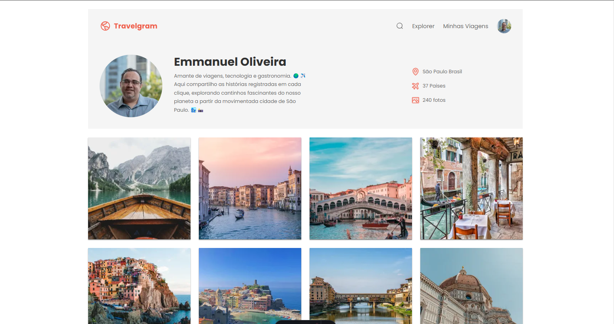

<!-- Banner de Apresentação -->
 
<br>
<br>

<!-- Titulo do Projeto -->
<div align="center">
</br>

<br>
<small>Framework de desenvolvimento</small>

<!-- Badges do Projeto -->


</div>

# 🌎 Travelgran

<!-- Menu -->

> [!NOTE]
> Table of Contents

- [Project description](#project-description)
  - [Functionalities](#functionalities)
- [Setup](#setup)
  - [Prerequisites](#prerequisites)
  - [technologies and tools](#technologies-and-tools)
- [Instalation](#instalation)
  - [Usage](#usage)
  - [Update](#update)
- [References](#references)
- [Contributors or owners](#contributors-or-owners)
  - [Contribute-to-the-projects](#contribute-to-the-projects)
- [Contact](#contact)
- [License](#license)

<!-- Descrição do Projeto -->

## Project Description

**Travelgran** é uma landing-page onde são divulgadas fotos de lugares turísticos pelo mundo.<br>
Projeto foi desenvolvido para a pratica de tecnologias, como `Astro`,`HTML`,`CSS`.<br>
Minha fonte de motivação deste projeto foi a [RocketSeat](https://www.rocketseat.com.br/).<br>

`Task`

- Desenvolver uma landing-page para divulgação de fotos.

`Charlenge`

Os Maiores desafios foram:<br>
trabalhar com compressão de _Imagens_ dentro do `Astro`.

### Functionalities

- [x] **Landing-page de fotos de viagens**

> [!TIP]
>
> Baixe o Projeto em seu Computador e veja como ficou.

<!-- Setup do Projeto -->

## Setup

Requisitos necessários para rodar o projeto:<br>

### Prerequisites

`Node.js` `VSCode` `Git`

> [!IMPORTANT]
>
> - Run Time [Node.js](https://nodejs.org/en/) com a versão _20 ou superior_.<br>
> - Um editor de códigos onde eu recomendo o [VCode](https://code.visualstudio.com/)<br>
> - E o [git](https://git-scm.com/downloads) uma aplicação de versionamento de código.

<!-- > - Extensão do VSCode [**Live Server**](https://marketplace.visualstudio.com/items?itemName=ritwickdey.LiveServer) -->

### technologies and tools

`Astro` `JavaScript` `HTML` `SASS` `Pnpm`

## Instalation

Para rodar o projeto em seu computador você tera que fazer o [fork](https://docs.github.com/pt/pull-requests/collaborating-with-pull-requests/working-with-forks/fork-a-repo) do repositório. Caso você não saiba como fazer, estou deixando um **link** da documentação oficial do gitHub, onde é esclarecido como fazer essse processo.<br> Fazendo esse processo você tera uma copia desse Repositório no seu GitHub.
<br>

<a href="https://docs.github.com/pt/pull-requests/collaborating-with-pull-requests/working-with-forks/fork-a-repo"></a>

Depois de ter feito o **fork** vamos fazer o [clone](https://docs.github.com/pt/repositories/creating-and-managing-repositories/cloning-a-repository) desse Repositório através do **VSCode**. </br>
Caso você não saiba como fazer, estou deixando um link para a documentação oficial do gitHub onde é esclarecido como fazer esse processo.
<br>
<sub>Command Line</sub>

```bash
git clone https://github.com/oliveirafullstack/travelgran
```


<a href="https://docs.github.com/pt/repositories/creating-and-managing-repositories/cloning-a-repository"></a>

Com o **VSCode** aberto, abra o **terminal**. pelo **VsCode** e vamos fazer a instalação das dependências necessárias para a execução do Projeto:

**1. Instalando as dependências**<br>

 <details open>

<summary>Gerenciador de pacotes usado</summary>

**Pnpm**

</sdetais>

<sub>Command Line</sub>

```bash
pnpm  install
```

<br>

## Usage

**2. Inicie o Servidor com o seguinte comando dentro do Terminal**<br>

<details open>

<summary>Gerenciador de pacotes usado</summary>

**Pnpm**

</sdetais>

<sub>Command Line</sub>

```bash
pnpm dev
```

</br>

> Ira aparecer um Pop-up solicitando que você clique para acessar o projeto no seu navegador.
> Segure a tecla <strong> Control </strong> e clique no local especificado, o projeto será aberto em uma nova aba do seu navegador Preferido.

<br>
 <!-- Imagem de Demostração -->
<h3 align="center"> Imagem de demostração do Projeto</h3>

</br>
</br>



<!-- <h3 align="center">📽️project demonstration video</h3>
<br>
<p align="center">Video de Demostração</p>

https://github.com/emmanuelmarcosdeoliveira/animais-fantasticos/assets/116108389/660fb676-c9a6-4083-b28c-8e952eaa6345 -->

<br>
 <div align="center">
Acesse a versão on-line Projeto clicando no Link Abaixo
<br>
<br>
<a href="https://travelgran.vercel.app/">
</a>

</div>
<br>

## Update

<br>

> Nessa seção teremos as atualizações do Projeto:

## References

**Acesse:** [RocketSeat](https://rocketseat.com.br/)

## Contributors or owners

<br>
<small>Emmanuel Oliveira</small>

developed by 💖 [Emmanuel Oliveira](https://www.linkedin.com/feed/?trk=homepage-basic_sign-in-submit)<br>
&copy; Todos os Direitos Reservados

### Contribute to the projects

> Clique na seta abaixo e veja como você pode contribuir para o projeto

<details close>
<summary>Como fazer uma contribuição ao Projeto ?</summary>
 
 - Familiarize-se com a documentação do projeto, que geralmente inclui guias de instalação.<br>
- Explore o código do projeto para entender sua estrutura e funcionamento.
<br>

**Faça um Fork**

- Crie uma cópia (fork) do repositório original em sua conta do GitHub.<br>


<a href="https://docs.github.com/pt/pull-requests/collaborating-with-pull-requests/working-with-forks/fork-a-repo"></a>

**Clone o Repositório**

Isso criará uma cópia local do projeto, onde você poderá fazer suas modificações.


<a href="https://docs.github.com/pt/repositories/creating-and-managing-repositories/cloning-a-repository"></a>

**Crie uma Nova Branch:**

- Crie uma nova branch para isolar suas alterações.<br>
- Isso facilita a organização do seu trabalho e a criação de pull requests.<br>

**Faça as Alterações:**

- Crie funcionalidades, mude estilos ou resolva `bugs` que iram contribuir para a melhoria do Projeto.<br>

**Crie um Pull Request:**

- Inclua uma descrição clara das suas alterações e explique como elas resolvem o problema ou melhoram o projeto.<br>
- Solicitação: Envie um pull request para o repositório original, solicitando que suas alterações sejam incorporadas ao projeto.
  <br>

**Revise e Responda a Feedback:**

- Colabore: Os mantenedores do projeto podem solicitar alterações ou fornecer feedback sobre o seu código.

</details>

## Contact

[](https://www.linkedin.com/in/emmanuel-marcos-oliveira/)
[](https://wa.me/5511968336094)
<a href="mailto:oliveirafullstack@gmail.com"> </a>

## License

<br>
Released in 2024 This project is under the **MIT license**<br>
<br>

[`voltar ao topo`](#-travelgran)
